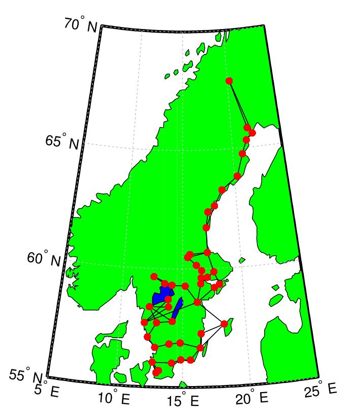

# Connected-graph-constraint
Code, figures and data for the paper:

> [A Connectedness Constraint for Learning Sparse Graphs][arxiv] \
by [Martin Sundin][masundi], [Arun Venkitaraman][arunv], [Magnus Jansson][mjansson] and [Saikat Chatterjee][saikat].

The paper was presented at the 2017 European Signal Processing Conference ([EUSIPCO2017][eusipco]) and is also available through [arxiv.org][arxiv].

Please report any bugs or errors to <sundin83martin@gmail.com>.


<figure>
</img>
<br>
<caption>Nearest neighbours reconstructed from temperature time series with the graph connectedness constraint.</caption>
</figure>

## Summary
An undirected graph with N nodes can be represented by an N x N real and symmetric adjacency matrix **A**. In many problems the adjacency matrix is not known but needs to be reconstructed. At the same time it is often desired that the reconstructed matrix is sparse. This typically leads to optimization problems of the form \

minimizer g(**A**) + eta * s(**A**),

where g(**A**) is the objective function we want to minimize to reconstruct the graph, s(**A**) is a sparsifying penalty function and eta > 0 is a regularization parameter.

One difficulty is that for large values of eta, the graph can become disconnected. In the paper we discuss how connectedness can be enforced as a contraint.

The convex optimization problems in the paper were solved using the [cvx][cvx] toolbox for Matlab.

## License and referencing
This source code is licensed under the [MIT][mit] license. If you in any way use this code for research that results in publications, please cite our original article. The following [Bibtex][bibtex] entry can be used.

```
@inproceedings{sundin2017connectedness,
  title={A connectedness constraint for learning sparse graphs},
  author={Sundin, Martin and Venkitaraman, Arun and Jansson, Magnus and Chatterjee, Saikat},
  booktitle={Signal Processing Conference (EUSIPCO), 2017 25th European},
  pages={151--155},
  year={2017},
  organization={IEEE}
}
```

[masundi]: https://www.kth.se/profile/masundi/
[saikat]: https://www.kth.se/profile/sach/
[mjansson]: https://www.kth.se/profile/janssonm/
[arxiv]: https://arxiv.org/abs/1708.09021
[mit]: http://choosealicense.com/licenses/mit
[bibtex]: http://www.bibtex.org/
[cvx]: http://cvxr.com/cvx/
[eusipco]: https://www.eusipco2017.org/